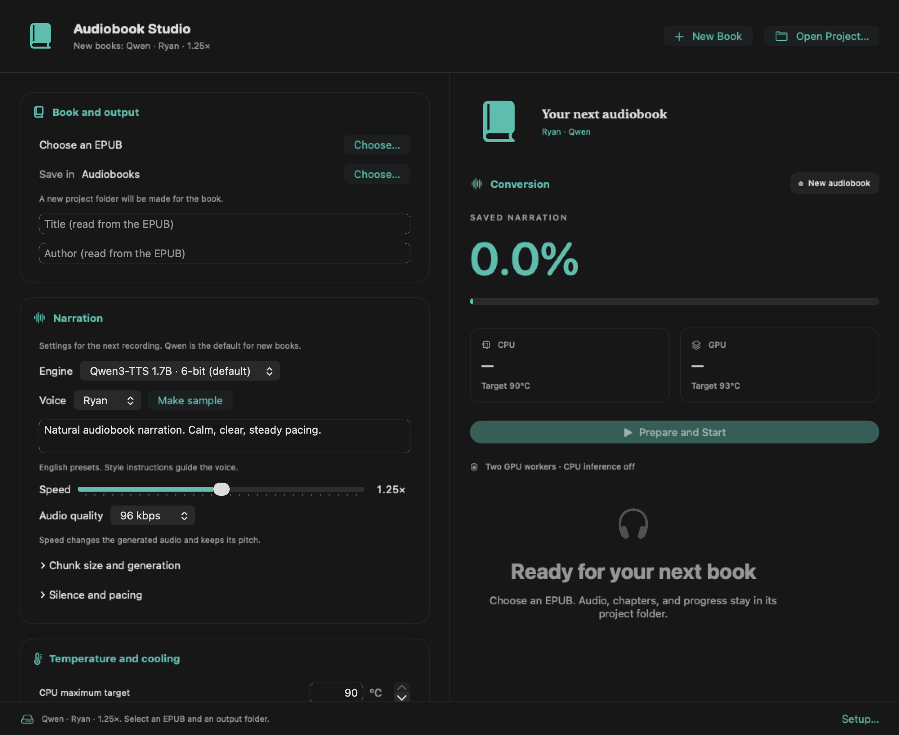
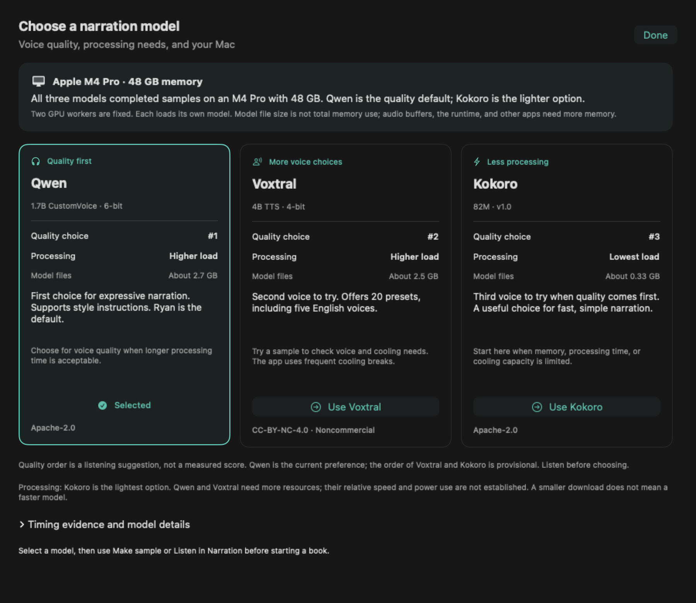

<p align="center">
  
</p>

<h1 align="center">Audiobook Studio</h1>
<p align="center"><strong>Your ebooks. Your narrator. Your Mac.</strong></p>
<p align="center">Turn an EPUB into a chaptered audiobook with a native Swift app and local speech models.</p>
<p align="center">
  
  
  
  
</p>

<p align="center">
  <a href="#get-started">Get started</a> ·
  <a href="#choose-your-narrator">Narrators</a> ·
  <a href="#how-it-works">How it works</a> ·
  <a href="#development">Development</a>
</p>



*App layout rendered from the SwiftUI source. No ebook or recording is included.*

## A small studio for long books

Choose a book, select a preset voice, and start. Audiobook Studio saves finished speech batches as it works. You can pause, resume, or close the app while a conversion continues. The finished M4B includes chapter markers and a cover when the EPUB provides one.

- **Local narration.** Qwen and Voxtral run through MLX-Audio. Kokoro uses PyTorch with Metal. Model downloads need the internet; narration runs on your Mac.
- **Qwen by default.** New books start with Qwen3-TTS 1.7B CustomVoice 6-bit, Ryan, at 1.25×. No voice cloning or reference recording is required.
- **Keep finished work.** Saved batches carry text and audio-setting signatures. Resume reuses matching audio. A new voice version gets a separate project folder.
- **Control the pace.** Set speed, audio quality, silence, chunk size, voice variation, style instructions, and cooling breaks.
- **Watch the heat.** Separate CPU and GPU readings control both workers. Missing readings pause processing.
- **Useful errors.** Short recovery messages link to local diagnostic reports. Reports are not sent to a server.

**Current scope:** a source-built macOS app, tested on an M4 Pro with 48 GB of memory. It is not a notarized, standalone download. The repository, Python environments, model files, FFmpeg, and temperature reader remain part of the installation. Other Apple Silicon models need sensor validation.

## Choose your narrator

| Engine | Preset voices | Best reason to choose it | Model license |
|---|---|---|---|
| **Qwen3-TTS 1.7B CustomVoice · 6-bit** | Ryan, Aiden | Default narrator; accepts style instructions | Apache-2.0 |
| **Voxtral 4B TTS · 4-bit** | 20 presets, including five English voices | More voice choices | CC-BY-NC-4.0 |
| **Kokoro 82M · v1.0** | Heart, Bella, Michael | Smaller model; faster in the local comparison | Apache-2.0 |

Qwen and Voxtral use pitch-preserving audio processing for speed changes. A value of **1.25×** makes the saved audio faster; it is separate from a player's playback-speed control.

### Choose for quality or processing time

Use **Compare models…** beside the engine selector. The app shows three model cards, the detected GPU and memory, model file sizes, and the limits of the timing evidence. Select a card to change an unsaved recording. Saved recordings keep their original model.

| Model | Suggested quality order | Estimated processing needs | Main reason to choose it |
| --- | --- | --- | --- |
| Qwen | 1 | Higher | Expressive narration and style instructions; the default |
| Voxtral | 2, provisional | Higher | More preset voices |
| Kokoro | 3, provisional | Lowest | Smaller model and faster local processing than Qwen |

The quality order is a listening suggestion, not a measured score. Qwen is the current listening preference; Voxtral and Kokoro have not had a blind quality comparison. The processing groups are estimates, not measurements of power use. The speed order between Qwen and Voxtral is not established.



The local 669-word sample took about **302 seconds with Qwen** and **115 seconds with Kokoro**, with different cooling settings and audio speeds. Voxtral's test had interruptions and changes to cooling controls, so it cannot establish a fair speed rank. See the [measurement report](reports/qwen-vs-kokoro.md).

All three models completed samples on an M4 Pro with 48 GB. Other devices show a prompt to test a sample. File sizes are about 2.7 GB for Qwen, 2.5 GB for Voxtral, and 0.33 GB for Kokoro's main weights. These are not memory requirements. Each of the two fixed GPU workers loads a model; buffers, runtimes, and other apps need more memory. Smaller downloads do not necessarily mean faster generation. See [model sources and selection guidance](docs/engines.md#model-selection-guide).

The model IDs and adapter details are in [Engine notes](docs/engines.md). Model weights are downloaded separately from [Hugging Face](https://huggingface.co/mlx-community).

### Why does an old project still show Kokoro?

The engine label describes the **saved recording**. Changing the app default does not regenerate old audio. Use **New Qwen version of this book** to prepare a separate Qwen recording with the same source. The original audiobook stays intact.

## Get started

You need an Apple Silicon Mac, Xcode command-line tools with Swift 6, Python 3.11, and FFmpeg. The Swift interface targets macOS 14 or later; the MLX runtime also needs a compatible macOS version. This release was tested on the author's M4 Pro, not across all supported OS versions.

### 1. Clone and prepare the local tools

```sh
git clone https://github.com/ojasviyadav/audiobook-studio.git
cd audiobook-studio

# With Homebrew already installed:
brew install python@3.11 ffmpeg
python3.11 -m venv .venv

# Build the temperature reader.
make -C vendor/smctemp -j1
c++ -std=c++17 -DARCH_TYPE_ARM64 -framework IOKit \
  -o vendor/smctemp/read_sensors \
  vendor/smctemp/read_sensors.cc \
  vendor/smctemp/smctemp.o vendor/smctemp/smctemp_string.o

zsh App/build-app.sh
open "Audiobook Studio.app"
```

The bundled sensor keys were checked on an **M4 Pro**. Do not assume they cover another chip. The guard requires valid CPU and GPU readings before narration can run.

### 2. Set up Qwen

In **Setup**, check the repository and Python runtime paths. For a new clone, use `.venv/bin/python` and `vendor/smctemp` as the temperature-reader folder.

Select **Install MLX Runtime**, then **Download Selected Model**, then **Check Setup**. The app creates `.venv-mlx` and stores the model in `models/qwen`. The Qwen checkpoint is about 2.7 GB; allow additional space for the runtime and generated audio.

For Kokoro, install `requirements-lock.txt` in `.venv`, install the `en_core_web_sm` spaCy model, and supply the Kokoro model files. See [local setup details](docs/local-usage.md#setup).

### 3. Make your audiobook

1. Select **New Book** and choose a readable EPUB or unpacked EPUB folder.
2. Choose the output folder. Qwen, Ryan, and 1.25× are already selected.
3. Use **Make sample** to check the voice and pace.
4. Select **Prepare and Start**. Watch saved progress, temperatures, and the time estimate.
5. When complete, select **Open in Apple Books**.

Saved voice and pacing settings are locked after audio is generated. Cooling settings remain adjustable. After a Mac restart, open the project and select **Resume**.

## Controls without guesswork

| Control | Available settings |
|---|---|
| Speed | 0.5×–2× |
| AAC quality | 64, 96, 128, or 192 kbps |
| Qwen narration style | Plain-language voice instructions |
| MLX chunk limit | 500–1,500 characters |
| Generation | Voice variation and token limit |
| Silence | Between speech segments and at chapter ends |
| Cooling | Separate CPU/GPU targets, pause/resume thresholds, work/rest periods |
| GPU configuration | Fixed at two Metal workers; CPU inference off |

Both workers share the Mac's GPU cores. They process separate sections; they are not separate physical GPUs. Only one book can run through the app at a time.

**Temperature targets are not hardware limits.** Work already queued on the GPU and other applications can raise temperatures after narration pauses. The maximum adjustable targets are 90°C for CPU and 93°C for GPU. The pause points stay below those targets. See [measured performance and limits](reports/qwen-vs-kokoro.md).

## How it works


The Swift app sends JSON commands to a Python bridge. A separate job process owns narration, so closing the window does not end an active conversion. A temperature supervisor controls the worker process group, including audio encoding.

Final checks cover section order, chapter markers, duration, and audio decoding. The pipeline rejects empty or token-limited model output. These checks do **not** prove perfect pronunciation or that a model spoke every word correctly.

<details>
<summary><strong>Project layout</strong></summary>

```text
App/Sources/          SwiftUI interface, task state, bridge, local diagnostics
App/Tests/            Swift tests and controlled task-order checks
app_bridge.py         JSON command interface
convert.py            EPUB preparation and conversion entry point
scripts/              Model adapters, workers, temperature guard, validation
vendor/smctemp/        Temperature-reader source and its license
tests/                Python pipeline and MLX adapter tests
docs/                 Setup, engine, and verification notes
reports/              Development measurements and their limits
```

Each conversion gets its own project folder with `book.json`, extracted sections, audio receipts, logs, and the finished M4B. The internal `kokoro-heart-build` folder name is retained for compatibility; `book.json` selects the actual engine.

</details>

## Listen on iPhone

Opening an M4B in Books on the Mac imports it into that Mac's library. For iPhone transfer, select the device in Finder, open **Audiobooks**, select the title, and apply the sync settings. Finder supports Wi-Fi sync after it has been configured. See [Apple's Finder sync guide](https://support.apple.com/en-gb/102471).

## Development

```sh
swift test -j 2
.venv/bin/python -m unittest discover -s tests -v
.venv/bin/python scripts/check_parallel_guard.py
.venv-mlx/bin/python -m unittest discover -s tests/mlx -v
zsh App/build-app.sh
```

The app uses Swift 6 concurrency checks. Tests cover stale replies after project changes, duplicate commands, cancellation, saved-engine identity, error messages, bridge failures, and saved-audio locks. The process-group check uses simulated temperatures and sleeping workers; it does not heat the Mac with inference.

Completed projects do not poll automatically. Active project checks stop when the window is inactive. Logs load on demand, and cover data is cached per project. `BridgeRequest` signposts mark command duration for Instruments. See [the app review](docs/app-review.md) and [verification history](docs/verification.md).

## Privacy and third-party code

Ebooks, extracted book projects, recordings, model weights, Python environments, and application logs are not included in this repository. Diagnostic reports remain in `~/Library/Logs/Audiobook Studio`, with bounded log rotation. They contain an error reference, operation, engine, recent action names, and error details; details can include local file paths. Check reports before sharing them.

This app expects a readable EPUB. It does not remove DRM.

Audiobook Studio source code uses the MIT License. The code in vendor/smctemp uses GPL-2.0.

The temperature reader includes [smctemp](https://github.com/narugit/smctemp), with its [GPL-2.0 license](vendor/smctemp/LICENSE). Model and dependency licenses apply separately. In particular, the selected Voxtral checkpoint has a noncommercial license. Model links and licenses are listed in [Engine notes](docs/engines.md).
